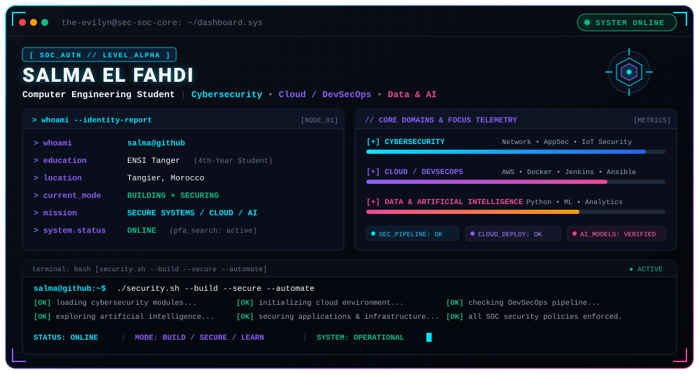

<div align="center">



<br><br>

<a href="https://www.linkedin.com/">
  
</a>

<a href="mailto:salmafahdi24@gmail.com">
  
</a>

<a href="https://github.com/the-evilyn">
  
</a>

</div>

---

## `> whoami`

```text
SALMA EL FAHDI
────────────────────────────────────────────

4th-year Computer Engineering Student
ENSI Tanger · Morocco

FOCUS
Cybersecurity
Cloud / DevSecOps
Data & AI

CURRENT OBJECTIVE
PFA Internship · Software Development · Cybersecurity
